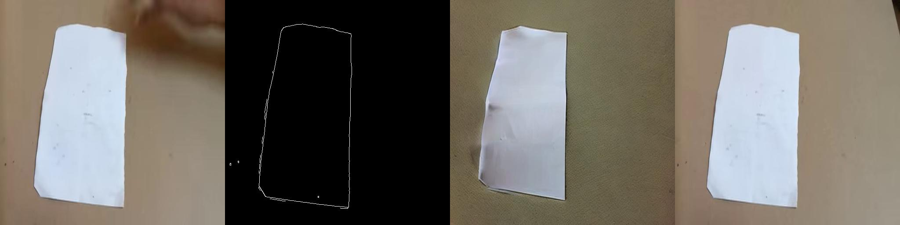

# Video Prediction with ControlNet (Something-Something V2)

This project implements a video prediction model using Stable Diffusion v1.5 and ControlNet. The goal is to predict the future frame (the 25st frame) of a human-object interaction video given the first 20 frames and a text description of the action.

The project focuses on three specific tasks from the Something-Something V2 dataset:
- `move_object`
- `drop_object`
- `cover_object`

## Project Structure

```
.
├── extract_direct.sh       # Script to extract the official dataset
├── processData512.py       # Preprocesses videos into frames (512x512) and metadata
├── augmentData.py          # (Optional) Augments the processed data
├── trainNew.py             # Main training script for fine-tuning ControlNet
├── evalNpy.py              # Evaluation script (SSIM, PSNR)
├── stable-diffusion-v1-5/  # (Required) Directory for Stable Diffusion v1.5 model
├── ControlNet-v1-1/        # (Required) Directory for ControlNet v1.1 model
├── extracted_videos/       # Output of extract_direct.sh
├── processed_data_512/     # Output of processData512.py
├── augmented_data_512/     # Output of augmentData.py (Input for trainNew.py)
└── evaluation_results/     # Output of evalNpy.py
```

## Prerequisites

- Python 3.8+
- CUDA-capable GPU (Recommended: 12GB+ VRAM)
- [Something-Something V2 Dataset](https://20bn.com/datasets/something-something) (files: `20bn-something-something-v2-00`, `20bn-something-something-v2-01`, and labels)

## Installation

1. Clone the repository.
2. Install the required Python packages:
   ```bash
   pip install torch torchvision torchaudio --index-url https://download.pytorch.org/whl/cu118
   pip install diffusers transformers accelerate opencv-python pandas numpy matplotlib tqdm
   ```

## Usage Workflow

### 1. Data Preparation

**Step 1: Extract the Dataset**
Place the dataset files (`20bn-something-something-v2-00`, `20bn-something-something-v2-01`) in the project root. Run the extraction script:
```bash
chmod +x extract_direct.sh
./extract_direct.sh
```
This will create an `extracted_videos` directory.

**Step 2: Process the Data**
Extract frames and generate metadata. This script selects the first 20 frames and the target 25th frame, resizing them to 512x512.
```bash
python processData512.py
```
Output directory: `processed_data_512/`

**Step 3: Data Augmentation (Recommended)**
Augment the data (e.g., horizontal flips) to increase the dataset size. `trainNew.py` is configured to look for data in `augmented_data_512` by default.
```bash
python augmentData.py
```
Output directory: `augmented_data_512/`

### 2. Model Preparation

You need to download the pre-trained models and place them in the project directory:

1.  **Stable Diffusion v1.5**: Download and place in `stable-diffusion-v1-5/`.
2.  **ControlNet v1.1**: Download (specifically the Canny model) and place in `ControlNet-v1-1/`.

### 3. Training

Fine-tune the ControlNet model using the processed data.
```bash
python trainNew.py
```
**Configuration:**
- The script uses `augmented_data_512` as the data source by default.
- Check the `Config` section in `trainNew.py` to adjust `BATCH_SIZE`, `LEARNING_RATE`, or `NUM_EPOCHS`.
- Checkpoints and visualization results will be saved to `final_model_output_viz_v5/` (or as configured).

### 4. Evaluation

Evaluate the trained model using SSIM and PSNR metrics on the test set.
```bash
python evalNpy.py
```
**Configuration:**
- Edit `evalNpy.py` to point `FINETUNED_CONTROLNET_PATH` to your best checkpoint (e.g., `./final_model_output_viz_v5/checkpoint-50/controlnet`).
- Results will be saved in `evaluation_results_comparison/`.

## Methodology

- **Input**: A sequence of 20 frames (stacked or last frame used as condition) + Text Prompt.
- **Conditioning**: Canny edge map of the last observed frame (frame 20).
- **Model**: Stable Diffusion v1.5 with ControlNet.
- **Output**: Predicted future frame (frame 25).

## Results

### Training Visualization
Below is a sample visualization from the training process (Epoch 50).



**Left to Right:**
1. Original 20th Frame (Input)
2. Canny Edge Map (Condition)
3. Predicted 25th Frame
4. Ground Truth 25th Frame

### Evaluation Comparison
Below is a comparison sample from the evaluation phase (`drop_object` task).


**Left to Right:**
1. Original 20th Frame (Input)
2. Ground Truth 25th Frame
3. Predicted 25th Frame (Zero-shot / Without Fine-tuning)
4. Predicted 25th Frame (Fine-tuned)

